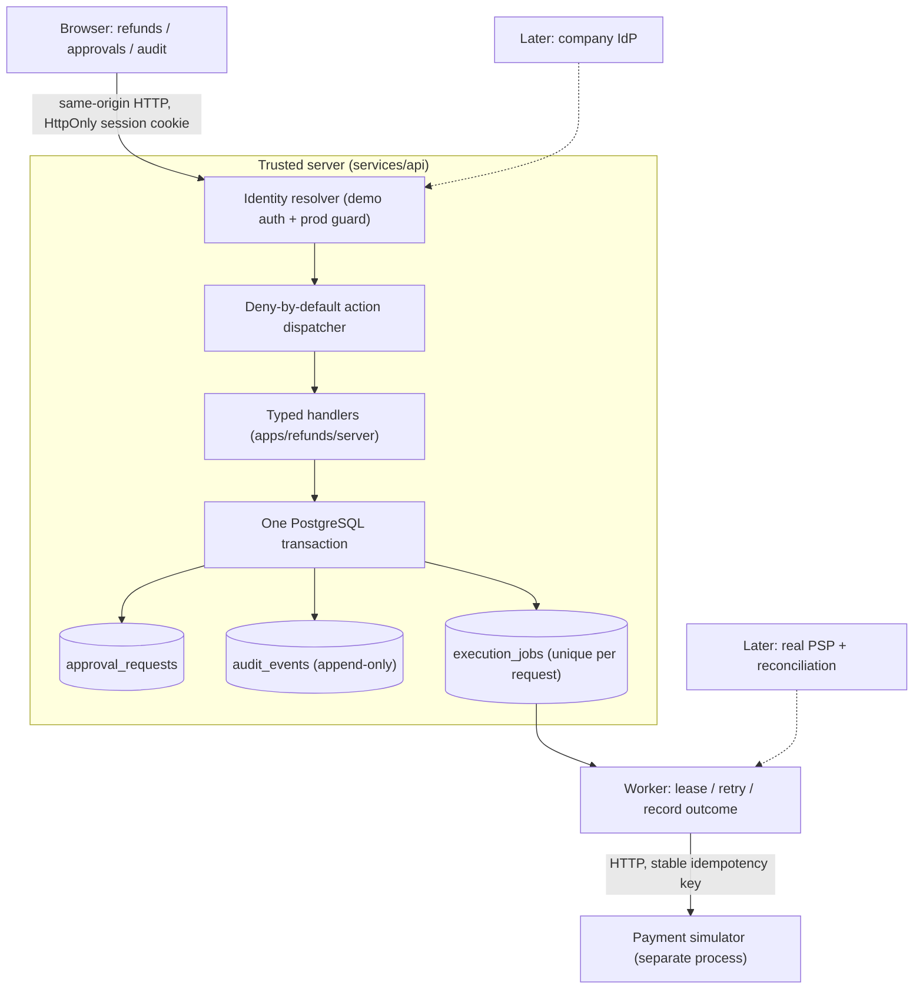

# Governed internal tools — refunds prototype built with Devin

A ~2-hour prototype answering one question for a fintech VP of Engineering: **can Devin build the
governed internal tools (refunds, feature flags, KYC review) that a $250K/year Power Apps license
currently provides, and what does the next app cost?**

It is deliberately *not* a Power Apps clone. It is one real workflow built end to end on a small,
company-owned foundation, with the controls a fintech actually needs:

- **Identity + deny-by-default permissions** — every mutation is a registered action with a required permission.
- **Maker-checker** — the requester can never approve their own request, including via direct API call.
- **Immutable requests** — amount/currency are server-derived; approval binds to the submitted snapshot.
- **Append-only audit** — the application DB role has no UPDATE/DELETE on `audit_events`; business state and audit event commit in one transaction.
- **Idempotent execution** — a worker executes approved refunds against a payment simulator with a stable idempotency key; a lost response + retry produces exactly one effect.
- **PII masking** — customer identifiers are masked server-side before they reach DTOs or audit summaries.

Status of each piece is tracked in `docs/BUILD_LEDGER.md`. See `docs/IMPLEMENTATION_PLAN.md` for scope,
architecture, gates, and the build-vs-buy framing.

## Architecture



Solid = implemented in this prototype. Dashed = priced, not built.

## Layout and ownership

| Path | What | Owner |
|---|---|---|
| `packages/contracts` | **Frozen** DTOs, zod schemas, action/error names, seed fixtures | Coordinator (human-reviewed) |
| `packages/server-core` | Identity, dispatcher, approvals/maker-checker, audit writer, DB/tx helpers | Backend session |
| `apps/refunds/server` | Refund handlers: request, review policy, job creation | Backend session |
| `services/api`, `services/worker`, `services/payment-simulator` | Process entry points; migrations + seed live in `services/api` | Backend session |
| `db/init` | Two DB roles: `tools_migrator` (owns schema) and `tools_app` (least privilege) | Coordinator |
| `web` | React shell: identity selector, payments, approvals queue, detail, audit timeline | UI session |
| `tests/contracts` | Black-box acceptance gates G1–G8 against live services | Coordinator |
| `.github` | CI, CODEOWNERS (humans own shared controls) | Coordinator |

Devin sessions build inside their owned paths. Changes to `packages/`, `services/`, `db/`, `tests/contracts/`
and `.github/` require a human code-owner review (`.github/CODEOWNERS`, enforced by branch protection).

## Run it

```bash
nvm use            # Node 24
corepack enable && corepack prepare pnpm@10.34.5 --activate
pnpm install
cp .env.example .env
pnpm db:up         # PostgreSQL 16 in Docker, creates the two roles
pnpm db:migrate && pnpm db:seed
pnpm dev           # API :4000, worker, payment simulator :4100, web :5173
```

Open http://localhost:5173. Demo identities (synthetic; demo auth refuses to start when `NODE_ENV=production`):

| Identity | Permissions | Use it to show |
|---|---|---|
| Ana Agent | request refunds | submit a refund for a seeded payment |
| Raj Reviewer | review refunds/flags | approve or reject someone else's request |
| Dana Dual | request **and** review | the self-approval denial (maker-checker) |
| Avery Auditor | read audit | the append-only event timeline |

## Run the gates

```bash
pnpm check                 # lint + typecheck + unit tests (no services needed)
pnpm test:acceptance       # G1–G8 against running API/worker/simulator/DB
```

| Gate | Asserts |
|---|---|
| G1 identity | no session → 401; body-supplied identity rejected; prod startup refuses demo auth |
| G2 policy | wrong role → 403; unregistered action denied; audit read needs `audit.read` |
| G3 separation | dual-role requester cannot approve own request (403 `SELF_APPROVAL`); another reviewer can |
| G4 integrity | amount/currency server-derived; extra payload fields → 422; one request per payment (409) |
| G5 concurrency | two simultaneous approvals → one decision, one audit event, one job |
| G6 execution | dropped simulator response + retry → exactly one simulated effect |
| G7 atomicity | fault before commit → no partial decision/event/job |
| G8 audit/privacy | app role cannot UPDATE/DELETE audit rows; raw emails absent from DTOs, audit, DB summaries |

## What this prototype does not do (on purpose)

Real SSO, live payment provider, reconciliation, partial refunds, retention/DLP, deployment,
observability, and the KYC queue. These are priced in the assessment, not built. See the plan.
