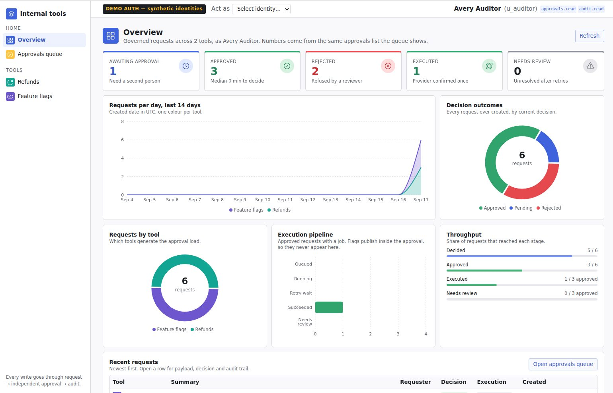

# Governed internal-tools platform

**A company-owned foundation for the internal tools a fintech usually builds in Power Apps, with Devin as the builder.**

Every internal tool at a regulated fintech has the same shape: someone requests a sensitive action, a different person approves it, the system executes it, and an auditor can see exactly what happened. Power Apps gives you that shape per app, on a licence. This repository gives you that shape once, in code you own, and shows that a new tool on top of it is a short Devin session plus one human review.

This prototype was built to answer one question for the build-vs-buy decision: **can Devin build these tools on a governed foundation we own, and what does the next tool cost?**

| | |
|---|---|
| One-page decision and pilot plan | `docs/KEY_DECISIONS.md` |
| Walkthrough by role (5 minutes) | `docs/PROTOTYPE_GUIDE.md` |
| Cost model and assumptions | `docs/ECONOMICS.md` |

## What is built

| | What it does | Evidence |
|---|---|---|
| **Platform** (`packages/`) | Identity with a production boot guard, deny-by-default permissions, maker-checker approvals (a requester can never approve their own request), an audit entry committed in the same transaction as every state change, durable execution with idempotent retries, PII masking | 24 black-box acceptance gates, green in CI. Specified and reviewed by a human, written by Devin. |
| **Refunds** (`apps/refunds`) | An agent requests a refund, an independent reviewer approves, a worker executes against the payment provider, an auditor sees the masked trail | End to end. 16 gates. |
| **Feature flags** (`apps/flags`) | Propose a flag change; an independent approval publishes it, with version-conflict detection | Built from the playbook in one 6-minute Devin session with zero changes to the platform. 8 gates. |
| **Shared UI** (`web/`, `packages/ui`) | One shell for every tool: sidebar, identity bar, an Overview dashboard, approvals queue, request detail, audit timeline; one design system underneath | 46 unit tests; tone and accessibility rules asserted. |
| **KYC review queue** | Case queue with assignment and vendor checks | **Scoped, not built.** Estimate in `docs/KYC_SCOPE.md`. |

**Measured build cost:** 26 Devin minutes across three sessions, plus about 45 human minutes of specification, acceptance criteria, integration and review (`docs/BUILD_LEDGER.md`).

## How it works

```
request  ─►  independent approval  ─►  execution  ─►  audit
```

- **Identity before authorization.** Every request resolves who is acting, then checks a declared permission. Unknown actions are denied.
- **Maker-checker.** The person who requested a change is refused as its approver, at the API, not only in the UI.
- **One transaction.** The business change, the approval decision, the audit entry and the execution job commit together or not at all.
- **Durable execution.** A worker carries out approved actions with a stable idempotency key, so a retry after a timeout cannot double-refund.
- **Audit you can rely on.** The application database role can insert audit rows but never update or delete them. This is append-only against application code, not against a database administrator; the hardening step below closes that.
- **PII stays masked** in every response and audit summary.

## The user interface



The team already knows Power Apps, so the UI keeps that shape: a left rail of tools, a header showing who you are, KPI tiles and charts, then the table that is the record.

- **One design system** (`packages/ui`), built on [Radix Themes](https://www.radix-ui.com/themes) for accessible components and colour scales, with Recharts for charts. Screens compose it and carry almost no styling of their own.
- **Five status tones** are the only status vocabulary: `ok`, `warn`, `danger`, `pending`, `neutral`. The rule: an unresolved outcome never looks like success. A refund waiting on the provider is `pending`; one that exhausted its retries is `warn`; only a provider-confirmed success is `ok`.
- **Tool colours are separate from status colours** (Refunds teal, Feature flags violet), so a tool's identity never reads as a state.
- **Dashboards derive from the audited data.** Every tile and chart is computed from the same records the tables show. There is no second, unaudited analytics source.

Screens: Overview across all tools (approvals awaiting, approved, rejected, executed, needs review; requests per day, decision outcomes, load by tool, execution pipeline), Refunds, Feature flags, Approvals queue, Request detail with audit timeline. Details: `packages/ui/README.md`, `web/README.md`.

## Adding the next tool

A new tool of the same shape (request → approve → execute → audit) is:

1. One Devin session from the playbook (`docs/prompts/03-new-app-playbook.md`): a folder under `apps/<name>` and `web/src/apps/<name>`, plus one line in each of two manifests. The API, worker, seed, sidebar, Overview and approvals queue pick it up without edits.
2. One human code-owner review.

Measured once at 6 Devin minutes. Treat that as a single data point until the pilot repeats it.

The rule that does not change: the authorization, approval and audit layer is specified and reviewed by humans. Devin writes it and builds tools on top of it; it never owns it.

## What is deliberately not here

Real SSO, a real payment provider, a deployment pipeline, DLP, retention and SIEM, audit rows for denied decisions, KYC. Each is priced as a labelled assumption in `docs/ASSESSMENT.md`. Authentication is a synthetic stub that refuses to start in production, and the payment provider is a simulator; both are explicit swap points, not shortcuts hidden in the code.

## Roadmap

1. **Harden for production** (pilot weeks 1–2): OIDC identity, insert-only audit role at the database, denied-access logging, staging deployment, secrets in a vault. Assumed 200 engineer hours (`docs/ECONOMICS.md`).
2. **Next tools of the same shape**: playbook runs, one review each.
3. **New shapes** (case queues such as KYC): add a case aggregate to the platform first, then build tools on it. This is platform work by the engineers who own `packages/`, not a playbook run.

## Run it locally

```bash
nvm use && corepack enable && corepack prepare pnpm@10.34.5 --activate
pnpm install && cp .env.example .env
set -a && source .env && set +a          # scripts read the shell env, not .env
pnpm db:up && pnpm db:migrate && pnpm db:seed
pnpm dev                                  # web :5173, API :4000, worker, simulator :4100
pnpm check && pnpm test:acceptance        # lint, types, 46 unit tests, 24 gates
```

Then open http://localhost:5173, pick an identity, and follow the five-minute tour in `docs/PROTOTYPE_GUIDE.md`.

## Documents

| Document | Purpose |
|---|---|
| `docs/KEY_DECISIONS.md` | One-page recommendation and pilot plan |
| `docs/PROTOTYPE_GUIDE.md` | Walkthrough by role, evidence per session, governance notes |
| `docs/ARCHITECTURE.md` | Trust boundaries, data model, request flow, ownership |
| `docs/CAPABILITY_MATRIX.md` | Power Apps capability vs. what is enforced here, with the test that proves it |
| `docs/ASSESSMENT.md` | Security and engineering assessment; every gap priced |
| `docs/ECONOMICS.md` | Cost model with labelled inputs |
| `docs/KYC_SCOPE.md` | KYC scoped, not built |
| `docs/BUILD_LEDGER.md` | Who built what, in how long, reviewed by whom |
| `docs/prompts/` | The session prompts and the new-tool playbook |
