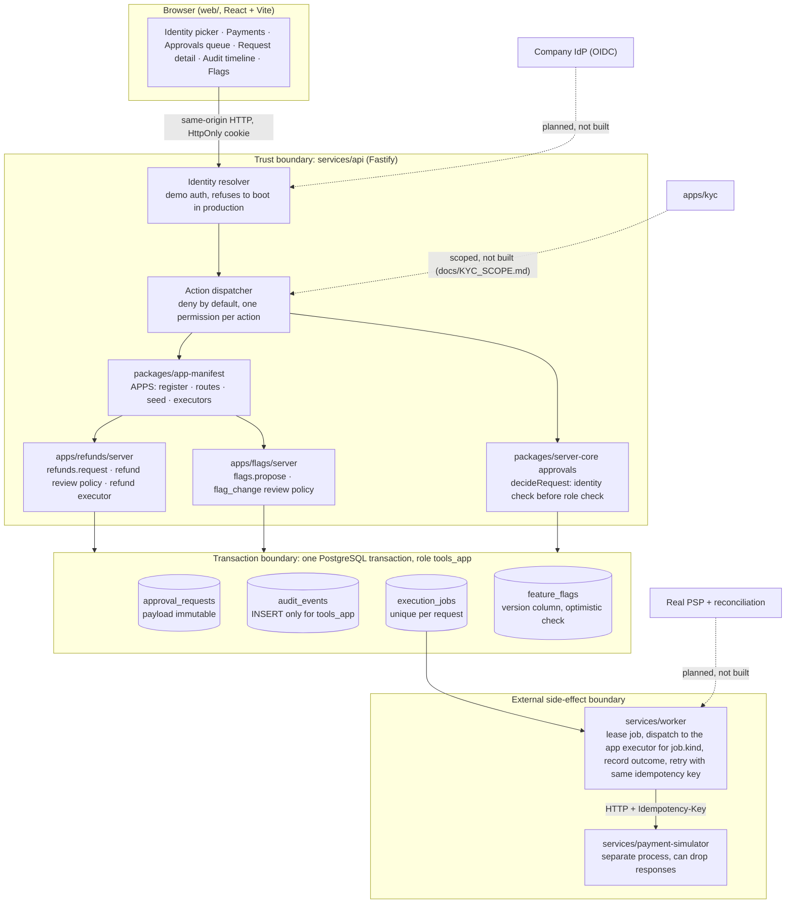

# Architecture

This document matches the merged tree at the head of the PR. Anything not in the tree is marked "planned, not built."

## Diagram

Legend: solid boxes exist in the tree and are covered by `tests/contracts`. Dashed boxes are planned, not built. Blue in the video diagram = `packages/server-core` + `packages/contracts`, specified and reviewed by a human, written by Devin in the backend session.

## Who wrote what

| Layer | Path | Specified by | Written by | Reviewed by |
|---|---|---|---|---|
| Contracts (DTOs, action names, error codes, seed data) | `packages/contracts` | coordinator | coordinator | human |
| Acceptance gates (black-box, against live services) | `tests/contracts` | coordinator | coordinator | human |
| Platform: identity, dispatcher, approvals, audit, tx, masking | `packages/server-core` | coordinator (docs/prompts/01) | Devin, backend session | coordinator on merge |
| Refunds app | `apps/refunds/server` | coordinator (docs/prompts/01) | Devin, backend session | coordinator on merge |
| Process hosts, migrations, seed | `services/*`, `db/` | coordinator | Devin, backend session; flags session added wiring | coordinator on merge |
| Web shell | `web/` | coordinator (docs/prompts/02) | Devin, UI session; flags session added Flags screen | coordinator on merge |
| Flags app | `apps/flags/server`, `db/migrations/0002_flags.sql` | coordinator (docs/prompts/03, the playbook) | Devin, flags session | coordinator on merge |
| CI, CODEOWNERS | `.github/` | coordinator | coordinator | human |

"Coordinator" is the parent Devin session acting on the human's plan. The human wrote the plan and approved the repository; every line of code in this repository was written by a Devin session.

## Request lifecycle (refund)

1. `POST /api/demo/session {userId}` sets an HttpOnly cookie. Any identity field in a request body is rejected with `VALIDATION`.
2. `POST /api/actions/refunds.request {paymentId}`. Dispatcher resolves the actor, looks up the registered action, checks `refunds.request`. Missing permission writes a `denied` audit row and returns 403.
3. Handler loads the payment, builds the payload server side (`amountMinor`, `currency`, masked `customerRef`), and in one transaction inserts `approval_requests` and one `audit_events` row.
4. `POST /api/actions/approvals.decide {requestId, decision}`. `decideRequest` locks the row `FOR UPDATE`, rejects if already decided, rejects if `actor.id == requester_id` (`SELF_APPROVAL`, checked before any role check), then checks the kind's review permission (`refunds.review`).
5. On approve, the kind's `onApproved` hook runs in the same transaction: refunds inserts one `execution_jobs` row with `idempotency_key = refund:<requestId>`; flags updates `feature_flags` if `version == expectedVersion`, else throws `STALE_VERSION` and the whole decision rolls back.
6. Worker leases `QUEUED` jobs, calls the simulator with the idempotency key, records `SUCCEEDED` or retries. The simulator is configured to drop a response in G6 so the retry path is exercised. Two effects for one key is a test failure.
7. `GET /api/audit?requestId=` requires `audit.read`. Summaries are allowlisted strings and never include raw email.

## Database roles

- `tools_migrator` owns the schema and runs migrations and seed.
- `tools_app` is what the API and worker connect as. It has no UPDATE or DELETE on `audit_events` and no UPDATE on `approval_requests.payload`. G8 proves both by attempting them as `tools_app` and expecting a PostgreSQL permission error.
- A database administrator can still alter rows. The audit log is append-only against application code, not tamper-proof.

## Enforced boundaries, in order of strength

1. PostgreSQL grants (audit immutability, payload immutability): enforced regardless of application code.
2. Transaction boundary (decision + audit + job/publish commit together): enforced by `withTx`, tested by G5 and G7.
3. Dispatcher (deny by default, one permission per action): enforced in `packages/server-core/actions.ts`, tested by G2 and F1.
4. Identity before role in `decideRequest`: tested by G3 and F2.
5. CODEOWNERS + CI: convention until branch protection is turned on in GitHub settings, which the coordinator cannot do from inside the repository.
6. Prompt-level ownership ("build only in `apps/<name>`"): weakest; the flags session legitimately touched `services/api` wiring. See the ledger. Since the structure pass, app registration is one line in `packages/app-manifest`, so a new app no longer edits `services/api` or `services/worker`.

## Planned, not built

OIDC against the company IdP; real PSP adapter and reconciliation job; partial refunds and multi-currency; denied-decision audit rows for `SELF_APPROVAL` and kind-permission failures; row-level scoping beyond "one request per payment"; retention, log shipping, SIEM; deployment pipeline; the KYC queue (`docs/KYC_SCOPE.md`).
