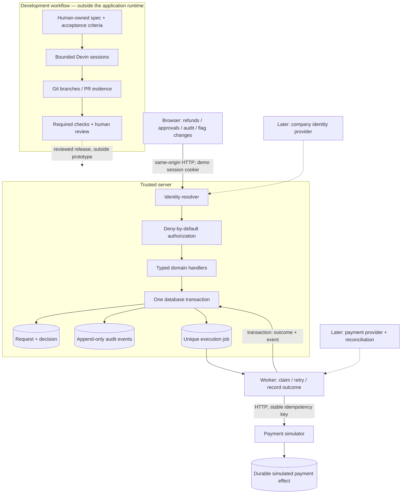

# Implementation plan: governed refunds with Devin

**Status:** proposed; no implementation sessions launched.  
**Implementation budget:** 120 elapsed minutes, including scaffolding, dependency setup, agent startup, integration, tests, and evidence capture. Parallel agent minutes and human effort are measured separately.  
**Assignment budget:** 3–4 hours total. Research already performed and this planning count toward it; parallelism does not erase that effort.

## 1. What we are trying to prove

**An operations agent can request a refund, a different authorized reviewer can approve it, and a worker can execute it against a payment simulator without producing a duplicate simulated refund. Every successful transition is reconstructable from an audit trail.**

Then, if the primary workflow passes its gates, add a small feature-flag change workflow to measure reuse.

The decision this supports is whether a company-owned foundation deserves a production pilot. The prototype does not establish that Power Apps can be retired, that $250K is avoidable, or that generated code is production-ready.

### Definition of a successful demo

1. Sign in as a seeded operations agent and request a refund.
2. Attempt self-approval through the API; the server denies it.
3. Sign in as a different reviewer and approve the immutable request.
4. Observe the simulated payment result and its audit history.
5. Replay the request and exercise a lost-response retry; the simulator records one refund.
6. If time permits, propose and approve a flag change, then show a tiny consumer reading the approved configuration.

Use synthetic data only. A visible banner identifies demo authentication and simulated payments.

### Scope decisions

| Build | Deliberately defer |
|---|---|
| Refunds from a few seeded captured payments | Live payment credentials, webhooks, reconciliation, settlement |
| USD, full refunds, one request per payment | Partial refunds, cumulative limits, re-submission after rejection |
| Named demo identities, permissions, server-side decisions | SSO, provisioning, offboarding, real organizational scopes |
| Shared approvals list; typed refund and flag handlers | Visual app builder, arbitrary workflow definitions, connector platform |
| Transactional audit events and durable execution jobs | Compliance retention, external tamper-resistant archive |
| Small boolean configuration consumer | Feature-flag SDKs, targeting, experimentation, global propagation |
| Repeatable local startup and automated checks | Production deployment, availability commitments, on-call rollout |

Full refunds and one request per payment are intentional domain limits. They let us spend the timebox on approval integrity and execution correctness without pretending we implemented a payment ledger.

## 2. Proposed stack and architecture

Use the client's established stack if one becomes available. For this standalone repository, use:

- **TypeScript throughout:** React + Vite for the UI; Fastify for the API.
- **PostgreSQL:** business records, approvals, audit events, durable jobs, and an isolated simulator store. Use real PostgreSQL in integration tests.
- **Kysely + node-postgres:** typed queries and migrations with explicit transactions.
- **Zod:** request validation and shared DTO schemas.
- **Vitest, ESLint, TypeScript checks:** domain tests, HTTP contract tests, lint, and type safety.
- **pnpm workspaces and Docker Compose:** one dependency lockfile and reproducible local services. Keep development and production configuration separate.

Exact compatible versions are pinned during scaffolding after checking availability. These dependencies have not been installed or validated yet.

This is a modular monolith with a worker entry point, not a collection of independently deployed domain services. The payment simulator is a separate HTTP process to preserve the external side-effect boundary in the demo.



Keep the final architecture graphic honest: solid lines mean implemented; dashed lines mean planned. The database transaction cannot include the external payment effect. Devin is a development tool and has no runtime dependency or production payment authority in this design.

### Shared interfaces to freeze before parallel work

The coordinator owns a small executable contract package:

- `Actor`: trusted server-resolved user ID and permissions. A request body cannot supply either.
- `Action`: registered name, required permission, input schema, and handler.
- `ApprovalRequest`: ID, app kind, requester ID, immutable typed payload, decision state, and timestamps.
- `decideRequest(actor, requestId, approve | reject)`: checks permission and maker-checker separation, then invokes the typed application handler.
- `AuditEvent`: actor or system identity, action, object ID, request/correlation ID, outcome, and an allowlisted summary.
- `ExecutionJob`: unique approval ID, stable provider idempotency key, lease, attempt count, and outcome.
- API DTOs and error shapes shared with the frontend and contract tests.

All mutations go through the action dispatcher. Missing registrations or missing permission declarations deny execution. Read endpoints have explicit read policies too. Do not introduce a general workflow language or allow the browser to choose an arbitrary executor.

Freeze this small HTTP surface in the scaffold:

| Endpoint | Contract |
|---|---|
| `POST /api/demo/session` | Development-only seeded identity selection; sets the server session cookie |
| `GET /api/me` | Resolved identity and effective permissions |
| `GET /api/refunds/payments` | Authorized, masked refundable-payment view |
| `POST /api/actions/refunds.request` | `{ paymentId }`; server derives the full amount and currency |
| `GET /api/approvals` | Authorized queue with typed summaries and decision/execution states |
| `GET /api/approvals/:id` | Authorized detail, including sanitized execution result |
| `POST /api/actions/approvals.decide` | `{ requestId, decision }`; dispatches to the request kind's review policy |
| `GET /api/audit?requestId=...` | Audit-reader-only sanitized history |

The decision endpoint must require the domain-specific review permission, not merely permission to view the common queue. Unknown JSON fields are rejected. Standard errors use `{ code, message, requestId }`; use 401 for missing identity, 403 for denied permission/self-approval, 404 for unavailable resources, 409 for decided/stale requests, and 422 for invalid input. The coordinator commits schemas and fixtures for these shapes before either child starts.

### Data and consistency decisions

- `payments`: seeded payment references and captured integer amounts in minor currency units.
- `approval_requests`: immutable request payload and mutable decision metadata. A unique refund subject key enforces one refund request per payment, including rejected requests.
- `audit_events`: no application-role update or delete privilege; no raw customer payloads.
- `execution_jobs`: one job per approved refund, including its stable idempotency key.
- `simulator_effects`: provider-owned idempotency key, request fingerprint, and recorded result. Stored separately from application credentials and accessed over HTTP.
- Optional `flag_configuration`: current boolean value and monotonically increasing version.

Request submission derives amount and currency from the server's payment record. The API offers no request-edit operation, and database grants permit lifecycle-column updates without granting updates to the immutable request payload. Approval therefore binds to the submitted snapshot; changing a business request is outside this prototype.

Approval takes a row lock or uses an equivalent compare-and-set transition. The decision, audit event, and unique job insertion commit together. Rejection creates no execution job. A second reviewer racing the first receives a stable conflict/already-decided result.

The worker claims a job with a lease and calls the simulator outside the business transaction. After a crash or timeout, another attempt uses the same key. The simulator atomically records one effect and its idempotency result; a changed payload under the same key is rejected. The worker then commits the result and audit event together.

Do not promise exactly-once execution across independent systems. The prototype demonstrates retries and idempotent effects against this simulator. Real provider retention windows, ambiguous outcomes, and reconciliation remain production work.

### State model

```text
Decision:  PENDING ──different authorized reviewer──> APPROVED
                  └─different authorized reviewer──> REJECTED

Execution, only after approval:
QUEUED → LEASED → SUCCEEDED
             ├→ RETRY_WAIT → LEASED  (same idempotency key)
             └→ NEEDS_REVIEW        (bounded retries / unresolved outcome)
```

An unresolved outcome never causes automatic submission under a new key. Show it explicitly in the UI.

### Identity, permissions, and privacy

- Seed an agent with request permission, a reviewer with review permission, a dual-role user for a meaningful self-approval test, and an auditor with audit-read permission.
- Demo login selects only a server-owned seeded identity and establishes a signed, HTTP-only cookie. Mutation routes enforce same-origin requests.
- Demo mode requires an explicit flag and development/test mode. Production startup must fail while only demo identity is configured. Production auth is not implemented.
- DTO serializers mask customer fields on the server. Raw seeded PII must not appear in unauthorized responses, audit fields, or ordinary logs.
- Migration credentials are distinct from application credentials. The application role cannot modify/delete audit history; a database administrator still can. State this limit.

## 3. Acceptance gates

These are the source of truth for agent prompts and the final report. A claimed result requires a command output or a recorded UI assertion.

| ID | Pass condition |
|---|---|
| G1 — identity | Missing/invalid session is denied; request-body identity is ignored/rejected; production startup rejects demo authentication. |
| G2 — policy | Every registered mutation has a permission policy; unauthorized roles and unregistered actions are denied. Shared read DTOs obey their policies. |
| G3 — separation | A dual-role requester cannot approve their own request through HTTP; a different authorized reviewer can. |
| G4 — request integrity | Amount/currency are server-derived; submitted payload is immutable; invalid amounts or attempted payload edits are rejected. |
| G5 — concurrency | Two simultaneous approvals produce one decision, one approval audit event, and one execution job. |
| G6 — execution | Repeated submission of the same business refund cannot create a second request; a lost simulator response and worker retry produce one durable simulated effect. |
| G7 — atomicity | An induced failure before transaction commit leaves no partial decision, approval event, or job. Successful execution and its final audit event also commit together. |
| G8 — audit/privacy | App-role UPDATE/DELETE of audit rows fails; raw seeded PII is absent from denied/masked responses and audit summaries. |
| G9 — reproducibility | Documented fresh-clone setup, migration, seed, lint, typecheck, tests, and build pass against PostgreSQL. |
| G10 — usability | Browser workflow covers request, denied self-approval, independent approval, result, and audit history without manually editing storage. |

Automated HTTP/database gates run from the shell. UI verification goes to the persistent testing agent once the user approves browser testing; it owns server/browser setup and records the run.

Two reusable test families cover policy completeness and negative behavior. They test this constrained architecture; they are not proof that arbitrary new code cannot bypass security.

## 4. How we parallelize without creating a merge problem

**Start with this coordinator and two independent child sessions on separate VMs.** This is a small split, so direct child sessions are sufficient; a dynamic workflow would add orchestration work without enough benefit inside this timebox. Each child consumes additional ACUs. Separate VMs give isolated working trees, and all handoffs use pushed Git commits.

Do not launch a separate “platform” writer alongside a refunds backend writer. They would both need to change the same transaction and permission code. One backend session owns that entire vertical slice.

```text
Coordinator: contracts, scaffolding, seed specification, acceptance fixtures
                                |
                    freeze and push base commit
                         /                \
               Backend session         UI session
                         \                /
                  Coordinator integration + gates
                                |
                   freeze shared implementation
                                |
              Conditional feature-flag reuse session
                                |
              regression + approved browser verification
                                |
                  evidence and submission package
```

### Ownership

| Workstream | Owns | Must not change |
|---|---|---|
| Coordinator | Root manifests/lockfile, shared DTO contracts, CI, cross-app HTTP acceptance tests, Compose, integration wiring, startup docs, evidence ledger | Child-owned implementation while children are running |
| Backend child | Server auth/policy/approval/audit modules, refund server handler, initial DB migrations, worker, payment simulator, unit/integration tests for those modules | Root dependency files, shared DTO contracts, frontend, coordinator acceptance tests |
| UI child | App shell, refund screens, approval queue, audit view, HTTP client, component tests | Backend, shared DTO contracts, root dependencies, migrations |
| Feature-flag child, later | Additive flag server/UI modules, additive flag migration, small config consumer, app-specific tests | Shared security/approval implementation, existing acceptance tests, dependency policy |
| Testing agent, after approval | Browser harness, running environment for its tests, recording/report | Product implementation, PR writes, changes to make tests pass |

Proposed directory boundaries:

```text
packages/contracts/         # frozen DTOs, schemas, action/error names
packages/server-core/       # identity, dispatcher, approvals, audit, DB utilities
apps/refunds/server/        # refund-specific handlers and queries
apps/refunds/web/           # refund-specific views
apps/flags/server/          # optional second-app addition
apps/flags/web/             # optional second-app addition
services/api/               # API composition; coordinator owns registration
services/worker/            # execution worker
services/payment-simulator/
web/                       # shared React shell and approvals/audit views
db/migrations/             # backend owns initial migrations
tests/contracts/           # coordinator-owned cross-app acceptance suite
```

The coordinator freezes the route names, field names, status/error shapes, permissions, and deterministic fixtures before fan-out. The UI can develop against fixtures, but the final demo must call the real API; no silent mock fallback.

Dependencies are predeclared. A child that needs a new dependency or contract change stops and reports it rather than editing the shared lockfile or inventing another interface. The coordinator resolves it explicitly and counts the intervention.

### Git handoff and review

- Candidate repository: `https://github.com/sidong0906/devin`. It is accessible and currently contains only a minimal README. Repository choice remains for the user to confirm.
- Publish the shared scaffold on a feature branch, then give both children its exact commit SHA.
- Each child works on its own branch and returns its SHA, changed files, checks/results, unresolved issues, and measured usage. Child branches do not merge themselves.
- The coordinator integrates reviewed commits into one implementation branch and opens a PR after basic lint passes. Children return branches rather than opening duplicate implementation PRs. No direct pushes to main and no automatic merge.
- After refunds passes, give the feature-flag child the exact integrated SHA. Measure its full branch-to-integration cost.
- Protect shared controls, contracts, CI, and ownership rules with required review/checks where repository permissions allow. Report configured repository enforcement separately from merely committed policy files.
- Treat a prompt's allowed-file list as an instruction, not a sandbox. Check returned diffs against that list before integration.
- Automated review feedback is evidence when available; record “not available” or “not completed within the timebox” instead of waiting indefinitely or inventing findings.

## 5. Implementation schedule and stop conditions

These are target budgets, not claims about work already completed. Start the implementation clock immediately before scaffolding, not after setup succeeds. Record the existing research/planning effort separately in the overall assignment ledger.

| Elapsed time | Action | Exit condition |
|---|---|---|
| 00:00–00:15 | Coordinator creates scaffold, pinned dependencies, contract schemas, role matrix, seed fixtures, test skeleton, run commands, and pushed base | Both children can work against the same documented contract |
| 00:15–00:55 | Backend and UI children run concurrently; coordinator writes black-box acceptance tests and root CI | Both branches delivered; individual lint/typecheck and owned tests pass |
| 00:55–01:10 | Integrate and run G1–G9; repair contract mismatches | Refunds is functional against the actual database and simulator |
| 01:10–01:30 | Only if core gates pass, run the feature-flag playbook experiment; coordinator reviews the core diff and prepares evidence | Working flag module, or a clearly reported failed/timed-out experiment |
| 01:30–01:45 | Freeze features; final shell checks and approved browser verification | Final tested revision and explicit unresolved gaps |
| 01:45–02:00 | Finish run instructions, export evidence, record cost counters, preserve final artifacts | Reproducible prototype, README, PR/repo links, test evidence |

**Cut rules**

- If the scaffold is not ready at minute 15, fix the specific blocker and shorten downstream scope; do not conceal setup time.
- If refunds misses the minute-70 gate, do not start feature flags. Preserve the remaining time for the core workflow.
- At **1:20**, refunds must run end to end; otherwise all secondary work is cut.
- At **1:30**, no new features or new implementation sessions. Retain flags only if its code is ready for final verification; otherwise keep its branch as an unsuccessful experiment.
- At **1:45**, stop coding. Capture what works, failed gates, and next steps. Do not label unresolved critical failures a successful prototype.
- At **2:00**, stop all prototype agents and validation work. Preserve results and report incompleteness. There is no hidden extra build session.

Agent advisory limits are not hard deadlines. The coordinator watches the global clock and explicitly stops outstanding work. At most one focused repair pass is budgeted for a failed handoff; repeated failure triggers a scope cut.

Browser testing needs user approval before kickoff so approval latency does not consume the closing window. The testing agent owns its setup and recording. If browser testing is not approved or cannot finish inside the cap, disclose the gap rather than substituting a claim based on backend tests.

## 6. The feature-flag reuse experiment

The second app is a boolean configuration change, not a replacement for LaunchDarkly or another flag-delivery system.

1. A maker proposes changing one seeded flag from its current value and version.
2. The shared queue displays the proposal; a different authorized reviewer decides.
3. The handler conditionally updates the flag only if the expected version still matches. A stale proposal produces a conflict and cannot overwrite a newer value.
4. The audit event and flag update are in one transaction.
5. A tiny consumer reads the approved server configuration and displays the changed behavior.

The flag handler uses the shared identity, authorization, maker-checker, audit, and approvals UI. It does not need a payment-style outbox because the effect is entirely inside the database transaction.

Allow explicit app registration as the extension point: one server registration entry and one UI navigation entry, applied/reviewed by the coordinator. Count these edits and their integration time. “No shared policy changes” is the goal; “zero files outside the app folder” would be a misleading promise.

Before kickoff, store the bounded prompt as a reusable Devin playbook and include its version/ID in the experiment ledger. Registering the playbook counts toward elapsed time. If platform approval makes registration unavailable, record a reusable-prompt experiment rather than claiming a playbook invocation happened.

**Success:** the second workflow passes the shared negative suite and its stale-version/consumer tests without changing existing security or approval behavior, within its 20-minute allowance. Record the actual human review/fix effort even on success.

**Failure:** report which abstraction had to change, which gate failed, or where time was spent. Keep the primary refunds demo clean; never weaken a guard to save the reuse claim.

## 7. Ready-to-use session briefs

Before launch, the coordinator substitutes the confirmed repository URL, base SHA, concrete allowed paths, exact absolute deadline, and checked-in contract locations. Each child receives the relevant sections of this plan in full; it does not inherit this conversation.

### Common instructions for every implementation child

> Work from the supplied base SHA on an isolated feature branch. Implement only your assigned paths and the specified acceptance criteria. Use the committed dependencies and shared contracts. Do not weaken tests, bypass hooks, change policy or lockfiles, or use real customer data. Run the supplied lint, typecheck, and owned test commands. Push your branch without merging; return the branch/SHA, changed files, test commands and outcomes, remaining failures, elapsed minutes, and available ACU usage. Stop at the supplied deadline and report partial work honestly. Escalate contract ambiguity instead of silently changing the interface. Do not do browser testing; that is a separate approved handoff.

### Backend session — 40-minute target

> Build the refunds vertical slice: seeded demo identity with a production-startup guard; deny-by-default action dispatch; immutable refund requests; a shared maker-checker decision service; application-role append-only audit events; transactional approval/job creation; leased worker execution; and a durable HTTP payment simulator with stable-key idempotency. Implement the frozen API contract and G1–G8, with PostgreSQL integration tests. Keep refunds full-amount/USD-only and one request per payment. Include a test-only lost-response scenario and demonstrate that retry yields one simulated effect. No generic workflow engine, real SSO, live payments, or feature flags.

### UI session — 40-minute target

> Build a usable operations interface against the frozen API: seeded identity selector with an explicit demo label, payments/refund request view, shared pending approvals, detail/result states, and audit timeline. Keep the selected actor visible. Present permission and self-approval failures from the server, including a readable conflict state. Display execution uncertainty without claiming success. Use the shared DTOs and deterministic fixtures during development; the integrated app must use the live API with no mock fallback. Provide loading, empty, error, and success states and owned component tests. Optimize the layout for a five-minute VP demo; no decorative dashboard charts or backend changes.

### Feature-flag playbook — 20-minute maximum, conditional

> Add a boolean flag-change workflow to the integrated refunds foundation using only the documented extension interfaces. Reuse identity, permissions, approvals, maker-checker, and audit. Include expected-version checking and a tiny consumer that reads the approved value. Add the shared negative suite and flag-specific stale-version tests. Return the expected registration edits for coordinator integration. Do not change existing shared policy, approval semantics, dependencies, or tests. If the extension requires a shared-code change, stop and explain it rather than making the change. Report time, interventions, checks, and remaining gaps.

## 8. Evidence, economics, and submission

### Evidence ledger

Record one row per session/stage:

```text
session URL | role | prompt/playbook version | base/head SHA
start/end UTC | wall minutes | agent usage and units | billed rate source
human active minutes | interventions | failed checks | review findings
final status | evidence links | remaining gaps
```

Unknown values remain unknown. Record actual usage units exposed by the account; do not force a guessed ACU conversion. The parent/coordinator's work is included alongside child usage. Parallel elapsed time and aggregate agent minutes are both reported.

The reviewer-facing evidence should show one actual prompt, its branch/PR, at least one meaningful automated check, and the intervention history. Do not manufacture a failure or review finding to improve the story.

### Economics worksheet

Use explicit assumptions for:

- Realizable license retirement, contract renewal timing, and retained KYC users.
- Power Apps delivery/maintenance labor versus custom delivery/maintenance labor.
- One-time migration, production identity/integration work, security review, and dual running.
- Recurring infrastructure, Devin, monitoring, patching, support, and ownership.
- Product work displaced by ongoing ownership, without double-counting salaries.

Show $0, partial, and full license-retirement scenarios. The two-hour prototype is a measured development experiment, not the production implementation estimate.

### Final repository and presentation

- **README:** problem, actual implemented scope, architecture diagram, startup/migrate/seed/check commands, demo identities, known limits, and production gaps.
- **Working source and tests:** including migrations, simulator, repeatable seeds, permission gates, and the second-app prompt/playbook reference if attempted.
- **Evidence:** actual build ledger and selected test/review artifacts. Keep screenshots and recordings out of source commits.
- **Key-decisions one-pager:** refunds scope, transaction and external-effect boundaries, ownership model, reuse result, and what would change the recommendation.
- **Five-minute Loom:** roughly 45 seconds on the problem/recommendation, two minutes of refunds and Devin implementation evidence, one minute on architecture/failure behavior, and 75 seconds on economics/pilot.

The candidate should present the VP narrative in their own voice. A browser-test recording is supporting evidence, not a substitute for the requested Loom presentation.

Prepare the final one-pager, economics, and talk track from measured results after the build stops. Keep the entire assignment within the stated total budget.

## 9. What happens immediately after plan review

1. Confirm the target repository. The accessible `sidong0906/devin` repo is a suitable blank starting point; use a dedicated new repository if preferred.
2. Confirm whether recorded browser verification is included.
3. Approve the scope, stack, timebox, and two-child split. Begin the implementation timer and create the executable contracts/scaffold.
4. Once that base is pushed, set up the backend and UI sessions concurrently. No implementation or child sessions have been started as part of this planning task.

### Research references

- Power Apps overview: https://learn.microsoft.com/en-us/power-apps/powerapps-overview
- Power Apps licensing: https://learn.microsoft.com/en-us/power-platform/admin/powerapps-flow-licensing-faq
- Managed environments: https://learn.microsoft.com/en-us/power-platform/admin/managed-environment-overview
- Required code-owner review: https://docs.github.com/en/repositories/managing-your-repositorys-settings-and-features/customizing-your-repository/about-code-owners
- Devin Ask for discovery/planning: https://docs.devin.ai/get-started/first-run#ask-mode
